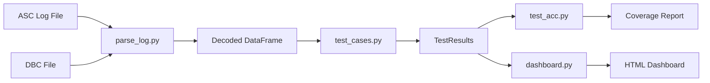

# 🚗 ACC CAN Signal Test Suite

[](https://www.python.org/downloads/)
[](https://pytest.org/)
[](#)

**A comprehensive Python test suite for validating Adaptive Cruise Control (ACC) CAN signals in automotive applications.**

This project demonstrates automotive software testing practices including CAN bus communication analysis, signal validation, and interactive visualization—skills essential for ADAS development at companies like **Porsche** and **Bosch**.

---

## 📋 Table of Contents

- [Overview](#-overview)
- [Features](#-features)
- [Architecture](#-architecture)
- [Quick Start](#-quick-start)
- [Test Cases](#-test-cases)
- [Dashboard](#-dashboard)
- [Project Structure](#-project-structure)
- [Skills Demonstrated](#-skills-demonstrated)

---

## 🎯 Overview

This test suite validates CAN bus signals from an Adaptive Cruise Control (ACC) Electronic Control Unit (ECU). It parses ASC log files, decodes signals using industry-standard DBC definitions, and executes comprehensive test cases to detect:

- **Overspeed conditions** (vehicle exceeding safe limits)
- **Communication timeouts** (ECU message gaps)
- **Emergency braking events** (sudden deceleration detection)
- **Signal integrity** (value bounds and checksum validation)

---

## ✨ Features

| Feature | Description |
|---------|-------------|
| 🔧 **DBC Parsing** | Decode CAN signals using `cantools` with industry-standard DBC files |
| 📊 **Interactive Dashboard** | Plotly-based HTML visualization with signal plots and violation markers |
| 🧪 **Pytest Integration** | Comprehensive test suite with >80% code coverage |
| 📈 **Signal Analysis** | Time-series extraction and statistical analysis |
| 🔍 **Violation Detection** | Automated detection of safety-critical events |

---

## 🏗️ Architecture



### Signal Definitions

| CAN ID | Message | Key Signals | Cycle Time |
|--------|---------|-------------|------------|
| 0x100 | Throttle | ThrottlePosition (0-100%) | 10ms |
| 0x101 | VehicleSpeed | Speed (0-300 km/h) | 20ms |
| 0x102 | BrakeSystem | BrakePressure (0-255 bar), Checksum | 10ms |

---

## 🚀 Quick Start

### Prerequisites

- Python 3.9 or higher
- pip package manager

### Installation

```powershell
# Clone or navigate to project directory
cd C:\Users\vinay\OneDrive\Desktop\2026\January\can-test-suite

# Create virtual environment
python -m venv venv

# Activate virtual environment (Windows)
.\venv\Scripts\activate

# Install dependencies
pip install -r requirements.txt
```

### Run Complete Pipeline

```powershell
# Run full test suite with coverage and dashboard generation
python run_all.py
```

### Run Individual Components

```powershell
# Run pytest only
pytest test_acc.py -v --cov=. --cov-report=html

# Generate dashboard only
python dashboard.py

# Parse and analyze log
python parse_log.py
```

---

## 🧪 Test Cases

### 1. Overspeed Detection
Identifies when vehicle speed exceeds 100 km/h threshold, indicating potential ACC control failure.

### 2. Message Timeout Detection
Detects gaps >2 seconds between CAN messages, indicating potential ECU or communication failure.

### 3. Emergency Stop Detection
Identifies emergency braking events characterized by:
- Brake pressure > 200 bar
- Deceleration > 20 km/h/s

### 4. Signal Bounds Validation
Verifies all decoded signal values fall within DBC-defined min/max limits.

### 5. Checksum Validation
Validates message integrity using brake message checksum field.

---

## 📊 Dashboard

The interactive Plotly dashboard (`test_results_dashboard.html`) provides:

- **Speed Timeline**: Vehicle speed with overspeed threshold and violation markers
- **Throttle Timeline**: Accelerator position over time
- **Brake Timeline**: Brake pressure with emergency threshold indicators
- **Test Summary**: Visual pass/fail status for all test cases

Open in any modern browser for interactive zoom, pan, and hover details.

---

## 📁 Project Structure

```
can-test-suite/
├── acc_signals.dbc          # CAN database definition
├── sample_can_log.asc       # Synthetic test log (10 seconds)
├── parse_log.py             # Log parsing and signal decoding
├── test_cases.py            # Test case implementations
├── test_acc.py              # Pytest test suite
├── dashboard.py             # Plotly dashboard generator
├── run_all.py               # Main orchestration script
├── requirements.txt         # Python dependencies
├── git_init.bat             # Git initialization script
├── notion_tracker.md        # Progress tracking template
└── README.md                # This file
```

---

## 💼 Skills Demonstrated

This project showcases competencies relevant to automotive software engineering roles:

| Skill | Implementation |
|-------|----------------|
| **CAN Bus Protocol** | ASC log parsing, DBC signal decoding |
| **Python Testing** | pytest fixtures, parametrized tests, coverage |
| **Data Analysis** | pandas DataFrames, signal processing |
| **Visualization** | Plotly interactive dashboards |
| **Automotive Standards** | ACC/ADAS signal validation |
| **Code Quality** | Type hints, docstrings, modular architecture |

---

## 📬 Contact

**Vinay** - Aspiring Automotive Software Engineer

*Built as a demonstration project for Porsche/Bosch recruiting process.*

---

<div align="center">

**[⬆ Back to Top](#-acc-can-signal-test-suite)**

</div>
